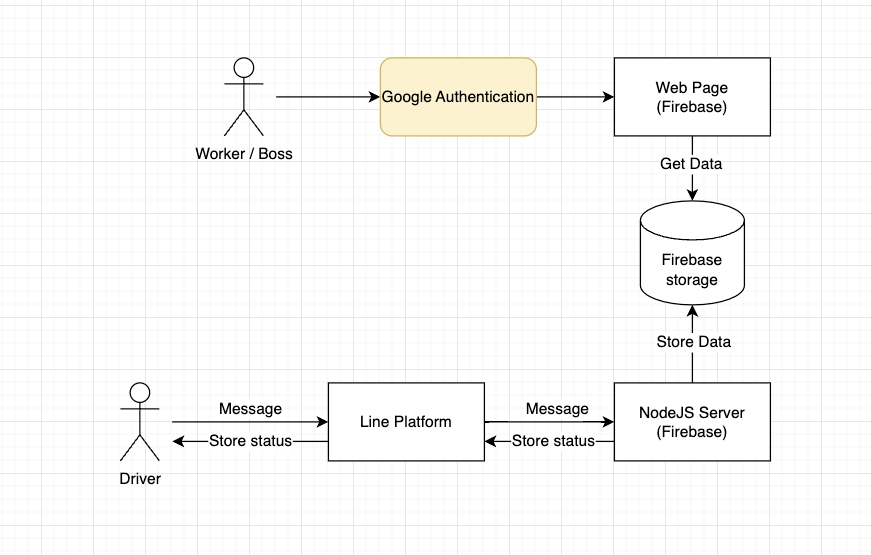

# auto store linebot

## 功能
讓使用者能夠在傳送 Line 訊息的同時更新資料庫，並在前端頁面上顯示資料庫的內容。

## 安裝
```bash
git clone git@github.com:aleetsaiya/auto-store-linebot.git

cd auto-store-linebot

## 安裝前端套件
npm install

## 移動到後端資料夾
cd functions

## 安裝後端套件
npm install
```

## 使用者流程


## 資料夾
+ src - 前端程式碼放置處
+ public - 前端程式碼的 production，`firebase deploy` 會將 public 資料夾內的檔案部署到 Firebase 上
+ functions - 後端程式碼的放置處
+ pictures - `README.md` 文件使用到的圖片位置

## 新增商品
要新增新的商品時，需要到 `src/translator.js`，將商品的中文及英文進去。

```javascript
// translator.js
const map = {
  波龍: 'boston-lobster',
  帝王蟹: 'king-crab',
  大閘蟹: 'hairy-crab',
  生蠔: 'oysters',
};

const mapReverse = {
  'boston-lobster': '波龍',
  'king-crab': '帝王蟹',
  'hairy-crab': '大閘蟹',
  oysters: '生蠔',
};
```

## 部署至 Firebase
部署整個 App (前端 + 後端):
```bash
npm install -g firebase-tools

firebase login

# to build the frontend app to public folder
npm run build

firebase deploy
```

單純部署後端;
```bash
cd functions
npm run delpoy
```

單純部署前端: 在專案根目錄執行 `npm run deploy`

## 使用技術
+ Node.js
+ Express
+ React
+ Material UI

## 第三方服務
+ Firebase Hoisting, Functions, Authentication, Realtime database
+ Line Message API